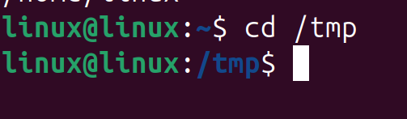
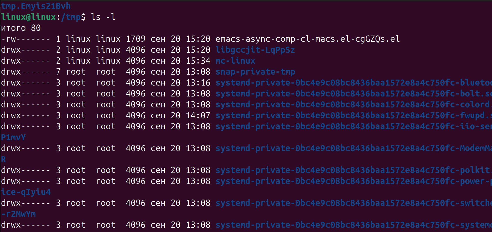
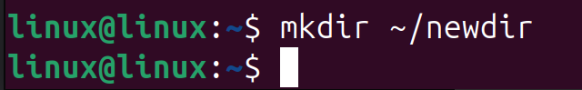

# Цель работы
Изучить работу в командной строке Linux: переход по каталогам, просмотр содержимого, работа с командами `ls`, `cd`, `pwd`, `mkdir`, `rmdir`, `rm`, а также использование истории команд.

# Задание
1. Определить домашний каталог.  
2. Перейти в каталог `/tmp`, вывести его содержимое разными способами.  
3. Проверить наличие каталога `/var/spool/cron`.  
4. Создать и удалить каталоги с использованием `mkdir`, `rmdir`, `rm`.  
5. Найти в `man ls` опции для рекурсивного просмотра и сортировки по времени.  
6. Изучить команды `cd`, `pwd`, `mkdir`, `rmdir`, `rm`.  
7. Освоить работу с историей команд (`history`).  

# Ход выполнения

## 1. Определение домашнего каталога
```bash
pwd
```
Результат: `/home/linux`  


---

## 2. Работа с каталогом `/tmp`

**2.1. Переход в каталог `/tmp`:**
```bash
cd /tmp
```


**2.2. Просмотр содержимого:**
- `ls` — краткий список  


- `ls -l` — подробный список (права, владельцы, размер и дата)  
  


Разница: `ls` показывает только имена файлов, `ls -l` — подробную информацию.

---

## 3. Проверка наличия каталога cron
```bash
ls -l /var/spool | grep cron
ls -ld /var/spool/cron
```
Каталог существует.  


---

## 4. Переход в домашний каталог и просмотр содержимого
```bash
cd ~
ls -l
```


Видно, что владельцем файлов является пользователь **linux**.

---

## 5. Создание и удаление каталогов

- Создание каталога `newdir`:  
```bash
mkdir ~/newdir
```


- Создание трёх каталогов одной командой:  
```bash
mkdir ~/letters ~/memos ~/misk
```


- Удаление их одной командой:  
```bash
rmdir ~/letters ~/memos ~/misk
```


---

## 6. Попытка удаления каталогов

- Попытка удалить `~/newdir` с помощью `rm` приводит к ошибке (требуется ключ `-r`).  
- Попытка удалить `~/newdir/morefun` не удалась, так как такого каталога нет.  


---

## 7. Использование man для изучения опций команды ls
```bash
man ls
```


---

## 8. Рекурсивный вывод содержимого каталогов
```bash
ls -R
```


---

## 9. Сортировка по времени изменения
```bash
ls -lt
```


```bash
ls -ltr
```


---

## 10. Работа с историей команд
```bash
history
```


# Контрольные вопросы

**1. Что такое командная строка?**  
Командная строка — это интерфейс взаимодействия пользователя с операционной системой с помощью ввода текстовых команд.  

**2. При помощи какой команды можно определить абсолютный путь текущего каталога?**  
Команда:  
```bash
pwd
```
Например, результат: `/home/linux`.  

**3. При помощи какой команды и каких опций можно определить только тип файлов и их имена в текущем каталоге?**  
```bash
ls -F
```
(отображает символ `/` для каталогов, `*` для исполняемых файлов).  

**4. Каким образом отобразить информацию о скрытых файлах?**  
```bash
ls -a
```
(показывает файлы, начинающиеся с `.`).  

**5. При помощи каких команд можно удалить файл и каталог? Можно ли это сделать одной и той же командой?**  
- файл: `rm filename`  
- пустой каталог: `rmdir dirname`  
- каталог с содержимым: `rm -r dirname`  
Да, `rm` можно использовать и для файлов, и для каталогов (с опцией `-r`).  

**6. Каким образом можно вывести информацию о последних выполненных пользователем командах?**  
```bash
history
```  

**7. Как воспользоваться историей команд для их модифицированного выполнения?**  
Можно вызвать команду по номеру:  
```bash
!15
```
или отредактировать с помощью клавиш стрелок ↑ ↓.  

**8. Примеры запуска нескольких команд в одной строке.**  
```bash
cd /tmp && ls
pwd; date
```  

**9. Дайте определение и приведите примеры символов экранирования.**  
Экранирование — это способ передать спецсимвол как обычный символ.  
Пример:  
```bash
echo "Hello \$USER"
```  

**10. Охарактеризуйте вывод информации на экран после выполнения команды ls с опцией -l.**  
`ls -l` показывает права доступа, количество ссылок, владельца, группу, размер файла, дату и имя.  

**11. Что такое относительный путь к файлу?**  
- Абсолютный путь — от корня: `/home/linux/file.txt`.  
- Относительный путь — от текущего каталога: `../file.txt`.  

**12. Как получить информацию об интересующей вас команде?**  
Через `man`:  
```bash
man ls
```  

**13. Какая клавиша или комбинация клавиш служит для автоматического дополнения вводимых команд?**  
Клавиша **Tab** (автодополнение имён файлов и команд).  

---

# Выводы
В ходе выполнения лабораторной работы я научился:
- определять домашний каталог и перемещаться по файловой системе;
- использовать разные режимы вывода команды `ls`;
- создавать и удалять каталоги;
- находить нужные опции команд через `man`;
- работать с историей команд.

Цель работы достигнута.

# Список литературы{.unnumbered}

::: {#refs}
:::
