---
## Front matter
title: "Отчет по выполнению лабораторной работы №7"
subtitle: "Анализ файловой системы Linux. Команды для работы с файлами"
author: "Аджабханян Овик"

## Generic options
lang: ru-RU
toc-title: "Содержание"

## Pdf output format
toc: true # Table of contents
toc-depth: 2
lof: true # List of figures
lot: true # List of tables
fontsize: 12pt
linestretch: 1.5
papersize: a4
documentclass: scrreprt
## I18n polyglossia
polyglossia-lang:
  name: russian
  options:
    - spelling=modern
    - babelshorthands=true
polyglossia-otherlangs:
  name: english
## I18n babel
babel-lang: russian
babel-otherlangs: english
## Fonts
mainfont: Liberation Serif
romanfont: Liberation Serif
sansfont: Liberation Sans
monofont: Liberation Mono
mainfontoptions: Ligatures=TeX
romanfontoptions: Ligatures=TeX
sansfontoptions: Ligatures=TeX,Scale=MatchLowercase
monofontoptions: Scale=MatchLowercase,Scale=0.9
## Misc options
indent: true
header-includes:
  - \usepackage{indentfirst}
  - \usepackage{float} # keep figures where there are in the text
  - \floatplacement{figure}{H} # keep figures where there are in the text
---

# Цель работы

Цель данной лабораторной работы — изучить структуру файловой системы Linux и освоить базовые команды для создания, копирования, перемещения файлов и каталогов, изменения прав доступа, а также научиться анализировать состояние дисковой подсистемы.

# Задание

1. Создание и просмотр файлов.  
2. Копирование и перемещение файлов и каталогов.  
3. Изменение прав доступа.  
4. Работа с системными каталогами.  
5. Анализ файловой системы: `df`, `mount`, `fstab`.  

# Теоретическое введение

В Linux используется иерархическая файловая система.  
Основные команды для работы с файлами:  

- `touch` — создание файла;  
- `cat`, `less`, `tail`, `head` — просмотр содержимого файлов;  
- `cp` — копирование файлов и каталогов;  
- `mv` — перемещение и переименование;  
- `chmod` — изменение прав доступа;  
- `df`, `mount` — анализ состояния системы и точек монтирования;  
- `fsck` — проверка целостности ФС;  
- `mkfs` — создание файловой системы.  

# Выполнение лабораторной работы

Создадим новый файл `abc1` командой `touch` и убедимся, что он появился в каталоге (рис. @fig:001).  

{#fig:001 width=70%}

Просмотрим содержимое файла `abc1` с помощью команд `cat` и `less` (рис. @fig:002).  

{#fig:002 width=70%}

Скопируем файл `abc1` в новый файл `april`, а затем ещё раз в файл `may`. После копирования проверим содержимое каталога (рис. @fig:003, рис. @fig:004).  

{#fig:003 width=70%}
{#fig:004 width=70%}

Создадим файл `abc1` и добавим группе право на запись (рис. @fig:005).  

{#fig:005 width=70%}

Создадим каталог `monthly` и изменим его права доступа, запретив чтение для группы и остальных пользователей (рис. @fig:006).  

{#fig:006 width=70%}

Создадим файл `may`, посмотрим его права и добавим владельцу право на исполнение (рис. @fig:007).  

{#fig:007 width=70%}

Создадим каталог `reports` и переместим в него каталог `monthly.01`. Проверим результат командой `ls` (рис. @fig:008, рис. @fig:009).  

{#fig:008 width=70%}
{#fig:009 width=70%}

Переименуем каталог `monthly.00` в `monthly.01`. Проверим результат (рис. @fig:010).  

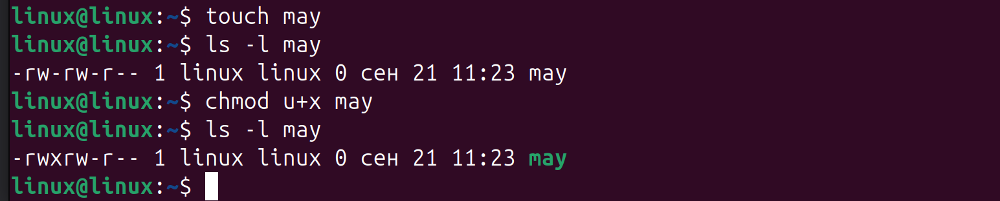{#fig:010 width=70%}

Переместим файл `april` в каталог `july`, а затем перенесём `july` в каталог `monthly.00`. Убедимся, что перемещение прошло успешно (рис. @fig:011).  

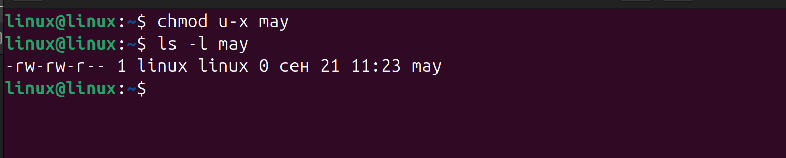{#fig:011 width=70%}

Создадим каталог `monthly.00` и скопируем в него содержимое каталога `monthly`. После этого скопируем `monthly.00` в `/tmp` (рис. @fig:012).  

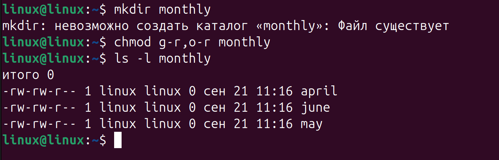{#fig:012 width=70%}

Скопируем файлы `april` и `may` в каталог `monthly`, а затем скопируем `may` в файл `june` внутри `monthly` (рис. @fig:013).  

{#fig:013 width=70%}

Удалим право на исполнение для файла `may`. Проверим результат (рис. @fig:014).  

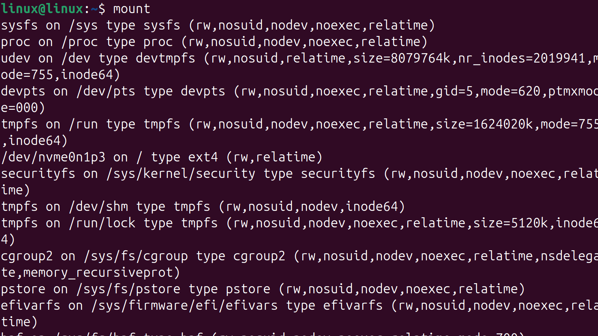{#fig:014 width=70%}

Проделаем комплекс упражнений с каталогами и файлами: `mkdir`, `cp`, `mv`, `chmod`. Проверим доступность файлов при изменении прав (рис. @fig:015).  

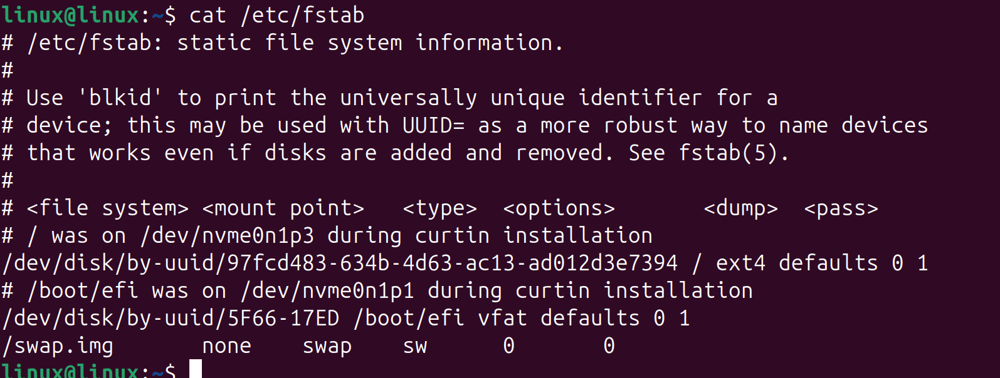{#fig:015 width=70%}

Проанализируем файловую систему: используем команды `mount`, `fsck` для проверки дисков (рис. @fig:016).  

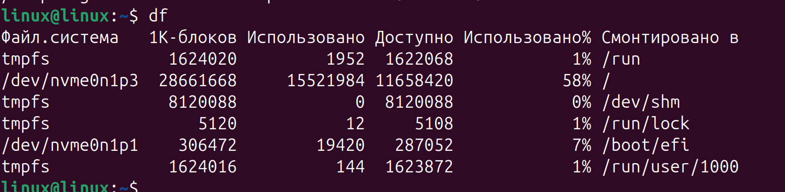{#fig:016 width=70%}

Просмотрим содержимое файла `/etc/passwd`, где хранятся сведения о пользователях (рис. @fig:017).  

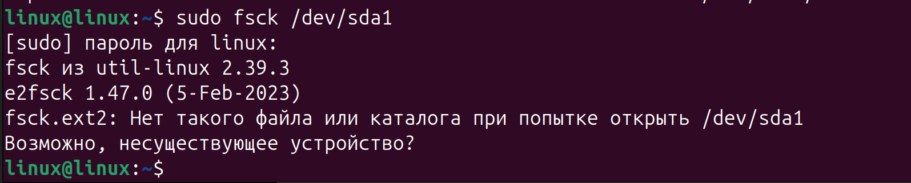{#fig:017 width=70%}

Создадим каталоги и назначим им права доступа: `australia`, `play`, а также создадим файлы `my_os` и `feathers` с заданными правами (рис. @fig:018).  

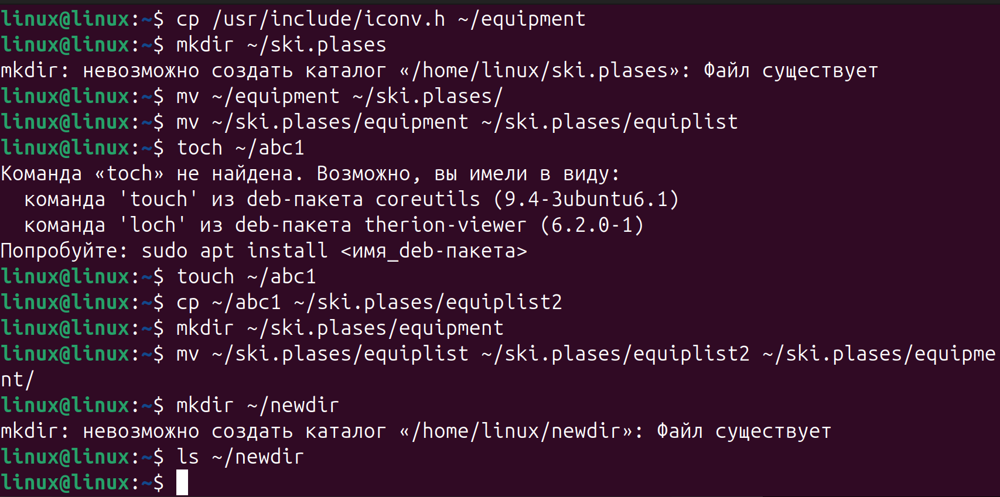{#fig:018 width=70%}

Переместим каталог `newdir` в другую директорию (рис. @fig:019).  

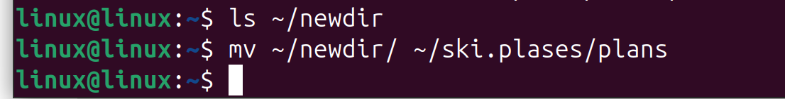{#fig:019 width=70%}

Скопируем файл `abc1` и каталог `equipment` в новый каталог `ski.plases`. Исправим ошибки в командах и убедимся, что перемещения выполнены корректно (рис. @fig:020).  

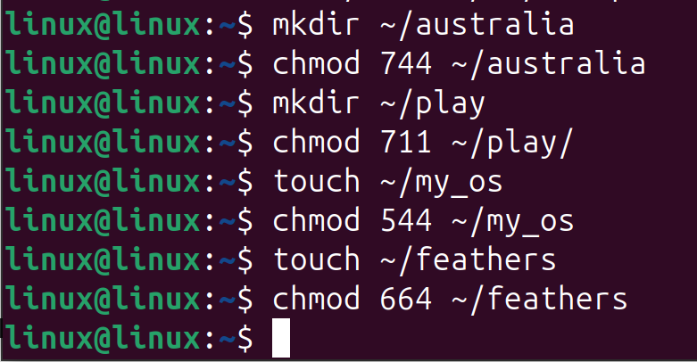{#fig:020 width=70%}

Выполним проверку диска `/dev/sda1` с помощью `fsck` (рис. @fig:021).  

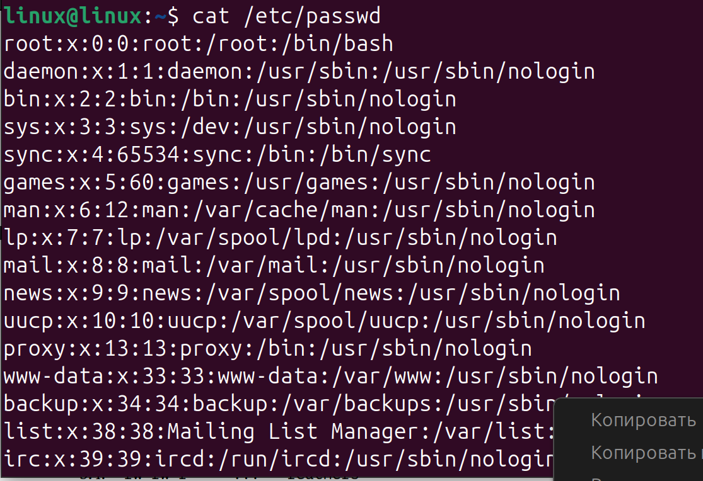{#fig:021 width=70%}

С помощью команды `df` выведем информацию о файловых системах (рис. @fig:022).  

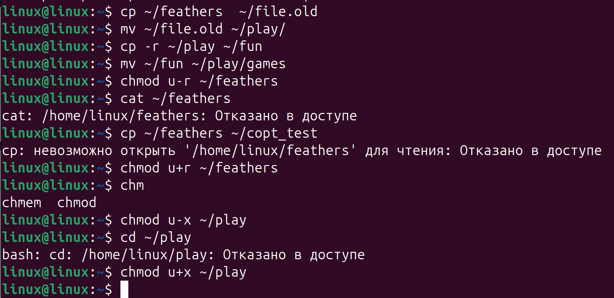{#fig:022 width=70%}

Изучим файл `/etc/fstab` и список смонтированных файловых систем через `mount` (рис. @fig:023).  

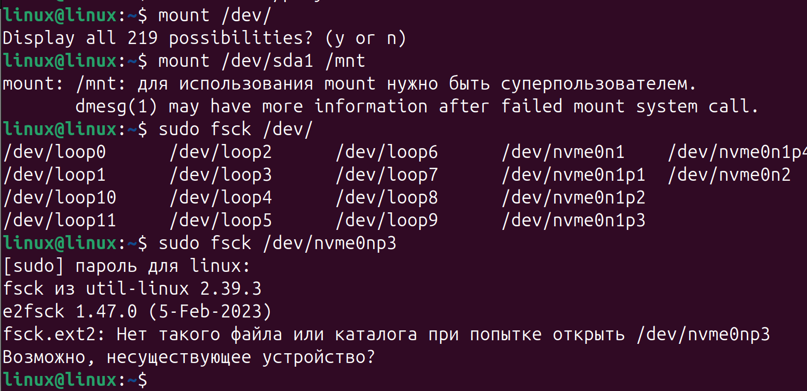{#fig:023 width=70%}

# Выводы

В результате выполнения лабораторной работы я освоил команды создания, копирования и перемещения файлов, изменения прав доступа, а также научился проверять и анализировать файловую систему Linux.

# Ответы на контрольные вопросы

1. **Характеристика файловых систем:** ext4 (основная для Linux), vfat (EFI), tmpfs (оперативная память).  
2. **Структура ФС:** `/` — корень, `/bin` — утилиты, `/etc` — конфигурация, `/home` — пользователи, `/var` — логи, `/usr` — приложения.  
3. **Для доступа к содержимому ФС нужно выполнить монтирование (`mount`).**  
4. **Причины нарушения целостности ФС:** сбои питания, аппаратные ошибки, некорректное выключение. Устранение — `fsck`.  
5. **Создание ФС:** команда `mkfs`.  
6. **Просмотр текстовых файлов:** `cat`, `less`, `tail`, `head`.  
7. **Команда cp:** копирование файлов и каталогов, ключи `-r`, `-i`, `-p`.  
8. **Команда mv:** перемещение и переименование файлов и каталогов.  
9. **Права доступа:** r (чтение), w (запись), x (исполнение). Изменяются `chmod`.  
