---
## Front matter
title: "Отчет по выполнению лабораторной работы №8"
subtitle: "Анализ файловой системы Linux. Команды для работы с файлами"
author: "Аджабханян Овик"

## Generic options
lang: ru-RU
toc-title: "Содержание"

## Pdf output format
toc: true # Table of contents
toc-depth: 2
lof: true # List of figures
lot: true # List of tables
fontsize: 12pt
linestretch: 1.5
papersize: a4
documentclass: scrreprt
## I18n polyglossia
polyglossia-lang:
  name: russian
  options:
    - spelling=modern
    - babelshorthands=true
polyglossia-otherlangs:
  name: english
## I18n babel
babel-lang: russian
babel-otherlangs: english
## Fonts
mainfont: Liberation Serif
romanfont: Liberation Serif
sansfont: Liberation Sans
monofont: Liberation Mono
mainfontoptions: Ligatures=TeX
romanfontoptions: Ligatures=TeX
sansfontoptions: Ligatures=TeX,Scale=MatchLowercase
monofontoptions: Scale=MatchLowercase,Scale=0.9
## Misc options
indent: true
header-includes:
  - \usepackage{indentfirst}
  - \usepackage{float} # keep figures where there are in the text
  - \floatplacement{figure}{H} # keep figures where there are in the text
---

# Цель работы

Цель данной лабораторной работы — изучить работу с файловой системой Linux, закрепить навыки использования команд `ls`, `grep`, `find`, `df`, `du`, управления процессами и работы с перенаправлением потоков ввода/вывода.

# Выполнение лабораторной работы

**1. Запись содержимого каталога /etc в файл file.txt**  

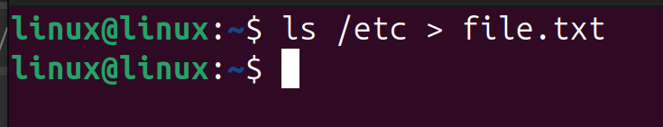{#fig:001 width=70%}

**2. Дополнение файла названиями файлов из домашнего каталога и поиск .conf**  

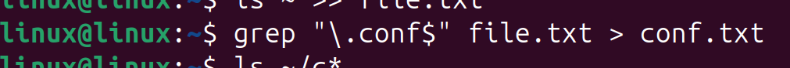{#fig:002 width=70%}

**3. Результат поиска файлов с расширением .conf**  

{#fig:003 width=70%}

**4. Попытка записи логов в файл logfile в фоне**  

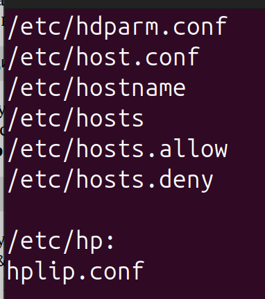{#fig:004 width=70%}

**5. Определение файлов в домашнем каталоге, начинающихся с c**  

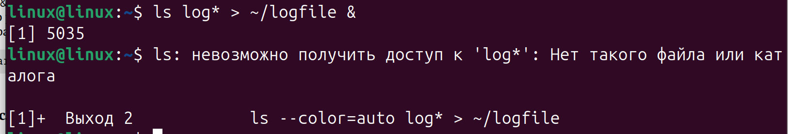{#fig:005 width=70%}

**6. Запуск редактора gedit в фоновом режиме**  

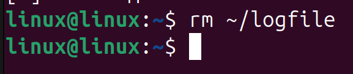{#fig:006 width=70%}

**7. Определение PID процесса gedit командой ps aux | grep**  

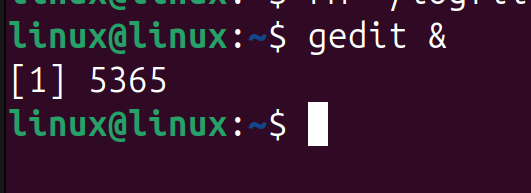{#fig:007 width=70%}

**8. Завершение процесса gedit командой kill**  

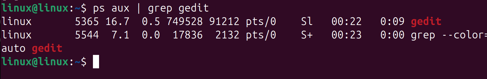{#fig:008 width=70%}

**9. Использование команды pgrep для поиска PID**  

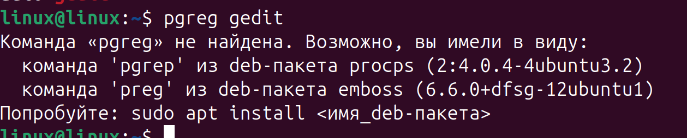{#fig:009 width=70%}

**10. Удаление файла logfile**  

{#fig:010 width=70%}

**11. Просмотр справки man для df и du**  

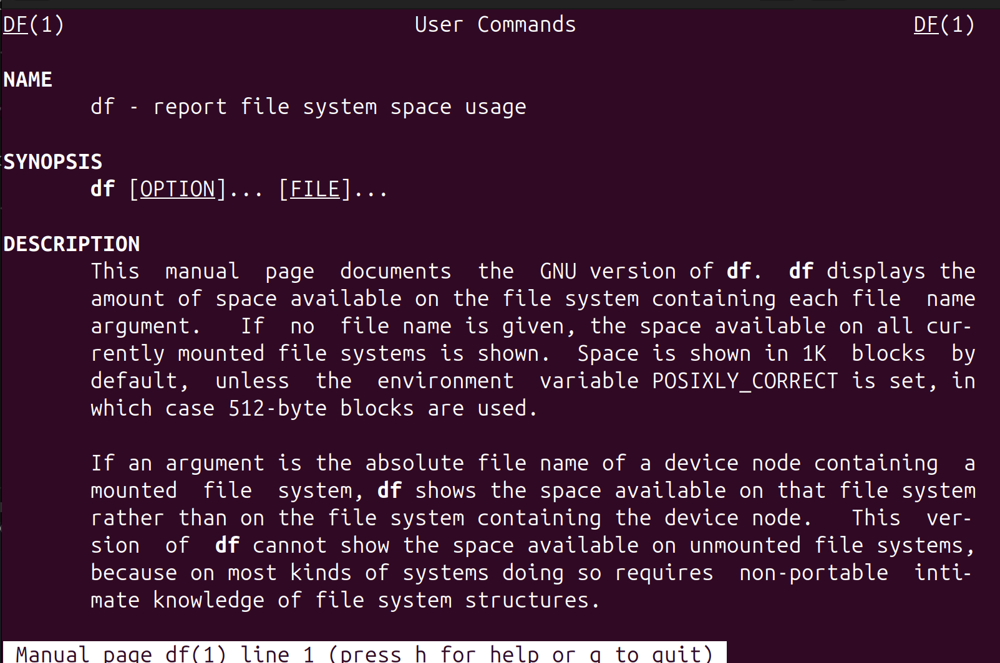{#fig:011 width=70%}  
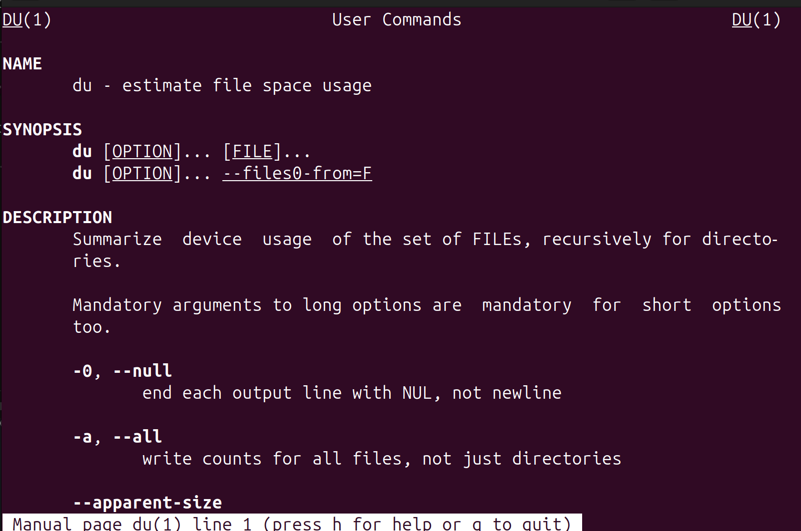{#fig:012 width=70%}

**12. Просмотр информации о файловой системе df -h**  

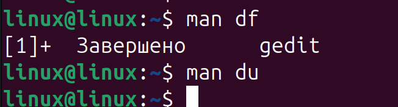{#fig:013 width=70%}

**13. Просмотр размера домашнего каталога командой du -h ~**  

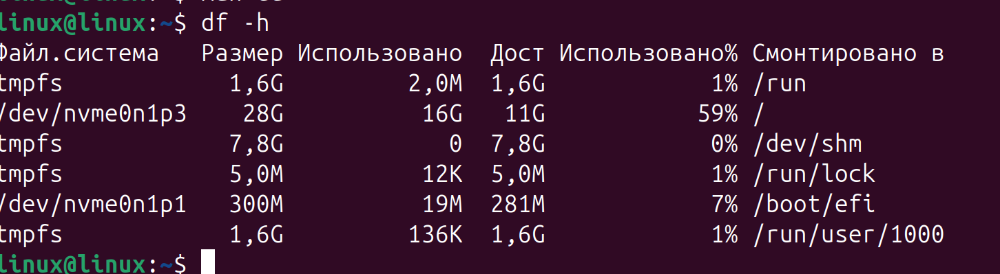{#fig:014 width=70%}

**14. Поиск всех директорий в домашнем каталоге командой find**  

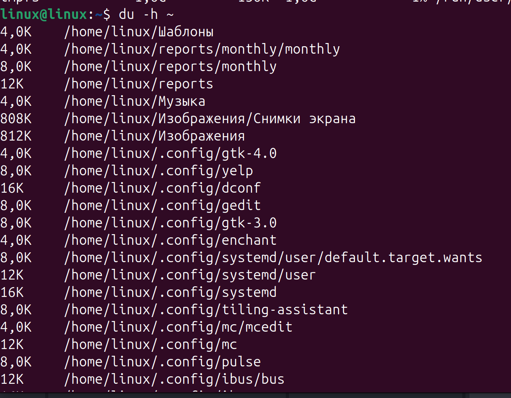{#fig:015 width=70%}

# Выводы

В ходе выполнения лабораторной работы я научился:  
- использовать перенаправление потоков `>` и `>>`;  
- фильтровать файлы по маске и расширению через `grep`;  
- искать каталоги через `find`;  
- управлять процессами (`ps`, `pgrep`, `kill`);  
- анализировать файловую систему командами `df`, `du`.  

# Ответы на контрольные вопросы

1. **Потоки ввода/вывода:** стандартный ввод (stdin), стандартный вывод (stdout), стандартный вывод ошибок (stderr).  
2. **Разница между > и >>:** `>` перезаписывает файл, `>>` добавляет данные в конец.  
3. **Конвейер:** механизм передачи вывода одной команды на вход другой (`|`).  
4. **Процесс и программа:** программа — набор инструкций на диске, процесс — выполняющаяся программа в памяти.  
5. **PID и GID:** PID — идентификатор процесса, GID — идентификатор группы процессов.  
6. **Задачи:** это процессы в фоновом режиме, управляются командой `jobs`, `fg`, `bg`.  
7. **Утилиты top и htop:** отображают информацию о процессах и использовании ресурсов в реальном времени; `htop` удобнее благодаря интерфейсу и навигации.  
8. **Команда поиска файлов:** `find`, пример: `find ~ -name "*.txt"`.  
9. **Поиск по содержимому файла:** `grep "строка" файл` или `grep -r "строка" каталог`.  
10. **Определение объема свободной памяти на диске:** `df -h`.  
11. **Определение объема домашнего каталога:** `du -h ~`.  
12. **Удаление зависшего процесса:** `kill PID` или `kill -9 PID`.  

